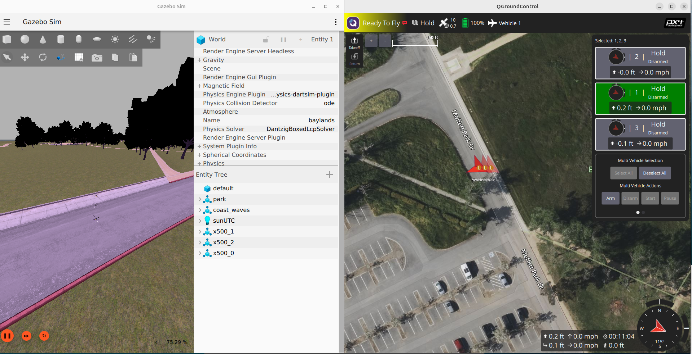

# 🛸 ROS 2 PX4 Swarm Simulation (Dockerized)

Nền tảng mô phỏng bầy đàn 3 UAV tự động. Dự án được đóng gói 100% bằng Docker, sử dụng **ROS 2 Jazzy**, **PX4 SITL**, **Gazebo Harmonic** và **MAVROS** làm cầu nối giao tiếp.

Docker giúp loại bỏ xung đột môi trường, giữ máy host sạch và hỗ trợ software rendering cho máy không có GPU rời.

## 🏗 Kiến trúc Hệ thống

[](https://hcmut-lab.github.io/ros2-px4-swarm/docs/architecture.html)

*(Click vào sơ đồ hoặc [vào đây](https://hcmut-lab.github.io/ros2-px4-swarm/docs/architecture.html) để xem bản tương tác.)*

**Luồng điều khiển:**
```
ROS 2 Node (px4_swarm)
  → pymavlink UDP  →  PX4 SITL  →  Gazebo Harmonic
  ← MAVROS topics  ←  (state, pose)
```

**Thuật toán:**
- **A\*** — lập kế hoạch đường đi toàn cục
- **Leader-Follower** — giữ đội hình V-shape
- **ORCA** — tránh va chạm thời gian thực

---

## ⚠️ Yêu cầu Hệ thống

- **OS:** Ubuntu 24.04 LTS
- **Màn hình:** X11 (không dùng Wayland)

> **Chuyển sang X11:**
> 1. `sudo nano /etc/gdm3/custom.conf`
> 2. Bỏ dấu `#` ở dòng `#WaylandEnable=false`
> 3. Lưu và `reboot`
> 4. Kiểm tra: `echo $XDG_SESSION_TYPE` → phải ra `x11`

---

## 🚀 Cài đặt (Lần đầu)

### Bước 1: Cài QGroundControl (trên máy thật)

```bash
sudo usermod -a -G dialout $USER
sudo apt-get remove modemmanager -y
sudo apt install gstreamer1.0-plugins-bad gstreamer1.0-libav gstreamer1.0-gl -y
sudo apt install libfuse2 libxcb-xinerama0 libxkbcommon-x11-0 libxcb-cursor-dev -y
```

> ⚠️ **Đăng xuất và đăng nhập lại** để quyền `dialout` có hiệu lực.

```bash
mkdir -p ~/ENV && cd ~/ENV
wget -O QGroundControl.AppImage \
    https://github.com/mavlink/qgroundcontrol/releases/download/v5.0.8/QGroundControl-x86_64.AppImage
chmod +x ./QGroundControl.AppImage
```

---

### Bước 2: Cài Docker Engine

```bash
sudo apt-get update
sudo apt-get install -y ca-certificates curl
sudo install -m 0755 -d /etc/apt/keyrings
sudo curl -fsSL https://download.docker.com/linux/ubuntu/gpg -o /etc/apt/keyrings/docker.asc
sudo chmod a+r /etc/apt/keyrings/docker.asc
echo \
  "deb [arch=$(dpkg --print-architecture) signed-by=/etc/apt/keyrings/docker.asc] https://download.docker.com/linux/ubuntu \
  $(. /etc/os-release && echo "$VERSION_CODENAME") stable" | \
  sudo tee /etc/apt/sources.list.d/docker.list > /dev/null
sudo apt-get update
sudo apt-get install -y docker-ce docker-ce-cli containerd.io docker-buildx-plugin docker-compose-plugin

sudo usermod -aG docker $USER
newgrp docker
```

---

### Bước 3: Lấy code và build image

```bash
mkdir -p ~/ros2_ws
cd ~/ros2_ws
git clone https://github.com/HCMUT-LAB/ros2-px4-swarm.git .
```

Tạo file `docker-compose.yml` tại `~/ros2_ws/docker-compose.yml`:

```yaml
services:
  swarm_env:
    build: .
    container_name: px4_swarm_jazzy
    network_mode: "host"
    privileged: true
    ipc: host
    environment:
      - DISPLAY=${DISPLAY}
      - QT_X11_NO_MITSHM=1
    volumes:
      - /tmp/.X11-unix:/tmp/.X11-unix:rw
      - .:/workspace/ros2_ws
    devices:
      - /dev/dri:/dev/dri
    command: tail -f /dev/null
```

### Bước 4: Build Docker (~20-40 phút lần đầu)

```bash
cd ~/ros2_ws
docker compose up -d --build
```

> ⚠️ Lần đầu mất **20-40 phút** vì phải compile PX4 + Gazebo. Các lần sau chỉ cần `docker compose up -d`.

---

## 🎮 Luồng Làm Việc Hàng Ngày

### 1. Khởi động container

```bash
cd ~/ros2_ws
docker compose up -d
```

### 2. Cấp quyền hiển thị đồ họa (bắt buộc trước khi dùng GUI)

```bash
xhost +local:root
```

### 3. Mở terminal trong container

```bash
docker exec -it px4_swarm_jazzy bash
```

---

## 🛸 Chạy Mô phỏng Bầy đàn 3 UAV

### Bước 1: Khởi động QGroundControl (trên máy thật)

```bash
cd ~/ENV
./QGroundControl.AppImage
```

Để QGC ở trạng thái chờ — nó sẽ **tự động phát hiện UAV** khi simulation khởi động.

### Bước 2: Khởi động simulation (bên trong container)

```bash
cd /workspace/ros2_ws/src/uav_swarm_demo
chmod +x run.sh   # Chỉ cần chạy 1 lần đầu

# Headless (nhẹ hơn, theo dõi qua QGC):
./run.sh

# Hoặc mở cửa sổ Gazebo 3D:
./run.sh --gui
```

> **Lưu ý:** Khi dùng `--gui`, phải chạy `xhost +local:root` trên máy thật trước.

Script tự động thực hiện:
1. **Gazebo server** — môi trường vật lý 3D, map Baylands
2. **3 UAV PX4 SITL** — spawn tuần tự tại `x = 0m, 2m, 4m`
3. **MAVROS** — 3 instance, mỗi UAV 1 namespace (`/uav0`, `/uav1`, `/uav2`)
4. **Build package** — `colcon build --symlink-install`
5. **Swarm node** — ARM → Takeoff 5m → Bay đội hình V-shape

Khi thấy `✅ UAV Swarm Demo đang chạy!` là hệ thống hoạt động.

### Bước 3: Kiểm tra kết nối

Trên QGC, **3 vehicle xuất hiện tự động** trên bản đồ Baylands. Panel **Multi Vehicle Selection** ở góc phải cho phép theo dõi đồng thời cả bầy đàn.

> **EKF2 cần ~15-30 giây** để hội tụ. Cảnh báo `heading estimate invalid` sẽ tự hết — chờ đến khi status chuyển sang **Ready To Fly**.

### Kết quả

[](docs/result_3_uav.png)

*Gazebo (trái): 3 UAV x500 spawn trên map Baylands. QGroundControl (phải): 3 vehicle kết nối tự động.*

### Bước 4: Dừng mô phỏng

Nhấn `Ctrl+C` trong terminal đang chạy script. Script tự dọn dẹp toàn bộ tiến trình.

---

## 📂 Cấu trúc Package

```text
~/ros2_ws/
├── Dockerfile
├── docker-compose.yml
└── src/
    └── uav_swarm_demo/
        ├── run.sh                          # Launcher tự chứa
        ├── package.xml
        ├── setup.py
        └── uav_swarm_demo/
            ├── nodes/
            │   └── px4_swarm_node.py       # Offboard controller (pymavlink + MAVROS)
            └── algorithms/
                ├── planner.py              # A* path planning
                ├── formation.py            # Leader-Follower
                └── collision_avoidance.py  # ORCA
```

---

## 🛑 Tắt hệ thống

```bash
cd ~/ros2_ws
docker compose down
```
