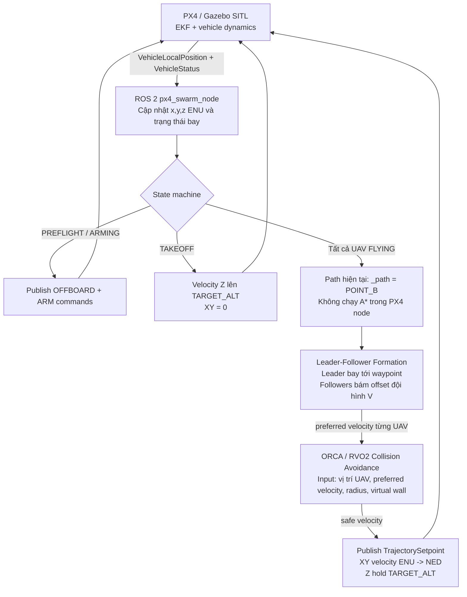

# 🛸 ROS 2 PX4 Swarm Simulation (Dockerized)

Nền tảng mô phỏng bầy đàn 3 UAV tự động. Dự án được đóng gói 100% bằng Docker, sử dụng **ROS 2 Jazzy**, **PX4 SITL**, **Gazebo Harmonic** và **Micro XRCE-DDS** làm cầu nối giao tiếp.

Docker giúp loại bỏ xung đột môi trường, giữ máy host sạch và hỗ trợ software rendering cho máy không có GPU rời.

## 🏗 Kiến trúc Hệ thống

[](https://hcmut-lab.github.io/ros2-px4-swarm/docs/architecture.html)

*(Click vào sơ đồ hoặc [vào đây](https://hcmut-lab.github.io/ros2-px4-swarm/docs/architecture.html) để xem bản tương tác.)*

**Luồng điều khiển:**
```
ROS 2 Node (px4_swarm)
  → px4_msgs (TrajectorySetpoint, VehicleCommand)  →  Micro XRCE-DDS Agent  →  PX4 SITL  →  Gazebo Harmonic
  ← px4_msgs (VehicleLocalPosition, VehicleStatus) ←
```

**Thuật toán:**
- **PX4 runtime hiện tại** — bay trực tiếp từ A đến B bằng một waypoint đích, giữ đội hình bằng Leader-Follower và chỉnh vận tốc bằng ORCA.
- **A\*** — đã có trong package cho node mô phỏng/RViz, nhưng chưa được nối vào `px4_swarm_node.py` để sinh đường bay PX4 runtime.
- **Leader-Follower** — giữ đội hình V-shape, follower bám theo leader.
- **ORCA** — tránh va chạm cục bộ theo thời gian thực giữa các UAV và vật cản polygon tĩnh đã khai báo.

### Pipeline thuật toán UAV-swarm

#### Pipeline PX4 runtime hiện tại

`px4_swarm_node.py` điều khiển PX4 theo vòng kín: vị trí thật/ước lượng được PX4 publish về ROS 2, node tính vận tốc mong muốn, ORCA chỉnh thành vận tốc an toàn, rồi node gửi `TrajectorySetpoint` ngược lại cho PX4.



Tóm tắt dạng tuyến tính:

```text
PX4 local position feedback
        ↓
Cập nhật trạng thái UAV trong node
        ↓
State machine: PREFLIGHT → ARMING → TAKEOFF → FLYING
        ↓
Direct waypoint: POINT_B
        ↓
Leader-Follower tạo preferred velocity
        ↓
ORCA chỉnh velocity để tránh UAV khác + virtual wall
        ↓
PX4 TrajectorySetpoint velocity
        ↓
Drone bay trong Gazebo/PX4
        ↓
PX4 publish vị trí mới và lặp lại
```

#### Pipeline thuật toán đầy đủ mong muốn

Phần A* đã tồn tại trong package, nhưng để PX4 runtime né vật cản toàn cục tốt hơn thì cần nối A* vào trước tầng formation để thay `_path = [POINT_B]` bằng danh sách waypoint quanh vật cản.

```text
Occupancy grid / static map
        ↓
A* Global Planner
        ↓
Waypoints tránh vật cản toàn cục
        ↓
Leader-Follower Formation
        ↓
ORCA tránh va chạm cục bộ
        ↓
PX4 Velocity Control
        ↓
UAV motion + local position feedback
```

> Nói ngắn gọn: bản PX4 runtime hiện tại là **điểm B đã biết trước → bay trực tiếp → giữ đội hình → ORCA né cục bộ → PX4**, chưa phải pipeline **A* → waypoint toàn cục → formation → ORCA → PX4**.

#### Input và output của framework

Ở runtime PX4 hiện tại, framework không nhận lệnh joystick hay danh sách waypoint động từ người dùng. Input chính là cấu hình mission trong code, feedback trạng thái từ PX4, và cấu hình vật cản tĩnh cho ORCA. Output chính là các ROS 2 `px4_msgs` gửi sang PX4 để arm, bật OFFBOARD và điều khiển vận tốc.

| Tầng | Input | Output | Ý nghĩa |
|------|-------|--------|---------|
| Mission/config | `NUM_UAVS`, `POINT_A_ENU`, `POINT_B_ENU`, `TARGET_ALT`, `MAX_SPEED`, `GRID_RES`, `CTRL_RATE`, `VIRTUAL_WALL_*` | Tham số nhiệm vụ và tham số điều khiển | Xác định số UAV, điểm đến, độ cao, giới hạn tốc độ và vật cản tĩnh đã biết trước. |
| PX4 feedback | `VehicleLocalPosition`, `VehicleStatus` từ từng namespace PX4 | State nội bộ `uav.x`, `uav.y`, `uav.z`, `armed`, `nav_state`, `preflight_pass` | Đây là input đo/ước lượng để node biết UAV đang ở đâu và có sẵn sàng bay không. |
| State machine | State nội bộ UAV + preflight/arming/offboard status | Lệnh `VehicleCommand` và velocity hover/takeoff | Chuyển UAV qua `PREFLIGHT → ARMING → TAKEOFF → FLYING → ARRIVED`. |
| Path/goal | Runtime hiện tại: `_path = [POINT_B]` | Waypoint hiện tại cho leader | Leader chỉ bám điểm B; A* chưa sinh waypoint cho PX4 runtime. |
| Leader-Follower | Vị trí leader/follower + waypoint + offset đội hình V | Preferred velocity `(vx, vy)` cho từng UAV | Tạo vận tốc mong muốn để leader đi tới đích và followers giữ đội hình. |
| ORCA/RVO2 | Vị trí UAV, preferred velocity, bán kính an toàn, virtual wall polygon | Safe velocity `(vx, vy)` cho từng UAV | Chỉnh vận tốc mong muốn thành vận tốc cục bộ an toàn hơn. |
| PX4 command output | Safe velocity ENU + `TARGET_ALT` | `TrajectorySetpoint`, `OffboardControlMode`, `VehicleCommand` | Gửi lệnh velocity XY, giữ độ cao Z, arm và bật OFFBOARD cho PX4. |
| Mô phỏng/vehicle output | PX4 nhận setpoint | UAV di chuyển trong Gazebo/SITL, rồi publish feedback mới | Đây là output vật lý/hiển thị của framework: bầy UAV bay, giữ đội hình và né cục bộ. |

Tóm tắt ngắn gọn:

```text
INPUT của framework
  = mission config trong code
  + PX4 feedback: vị trí/trạng thái từng UAV
  + obstacle polygon tĩnh cho ORCA

OUTPUT của thuật toán
  = safe velocity cho từng UAV

OUTPUT của ROS 2/PX4 interface
  = OffboardControlMode + VehicleCommand + TrajectorySetpoint

OUTPUT cuối cùng
  = UAV bay trong Gazebo/PX4, sau đó PX4 feedback vị trí mới để đóng vòng lặp
```

---

## ⚠️ Yêu cầu Hệ thống

- **OS:** Ubuntu 24.04 LTS
- **Docker Engine** (không cần GPU rời — simulation dùng software rendering)
- **QGroundControl** — theo dõi trạng thái 3 UAV trên bản đồ, kiểm tra arm/mode/telemetry

---

## 🚀 Cài đặt (Lần đầu)

### Bước 1: Cài QGroundControl (trên máy thật)

```bash
sudo usermod -a -G dialout $USER
sudo apt-get remove modemmanager -y
sudo apt install gstreamer1.0-plugins-bad gstreamer1.0-libav gstreamer1.0-gl -y
sudo apt install libfuse2 libxcb-xinerama0 libxkbcommon-x11-0 libxcb-cursor-dev -y
```

> ⚠️ **Đăng xuất và đăng nhập lại** để quyền `dialout` có hiệu lực.

```bash
mkdir -p ~/ENV && cd ~/ENV
wget -O QGroundControl.AppImage \
    https://github.com/mavlink/qgroundcontrol/releases/download/v5.0.8/QGroundControl-x86_64.AppImage
chmod +x ./QGroundControl.AppImage
```

---

### Bước 2: Cài Docker Engine

```bash
sudo apt-get update
sudo apt-get install -y ca-certificates curl
sudo install -m 0755 -d /etc/apt/keyrings
sudo curl -fsSL https://download.docker.com/linux/ubuntu/gpg -o /etc/apt/keyrings/docker.asc
sudo chmod a+r /etc/apt/keyrings/docker.asc
echo \
  "deb [arch=$(dpkg --print-architecture) signed-by=/etc/apt/keyrings/docker.asc] https://download.docker.com/linux/ubuntu \
  $(. /etc/os-release && echo "$VERSION_CODENAME") stable" | \
  sudo tee /etc/apt/sources.list.d/docker.list > /dev/null
sudo apt-get update
sudo apt-get install -y docker-ce docker-ce-cli containerd.io docker-buildx-plugin docker-compose-plugin

sudo usermod -aG docker $USER
newgrp docker
```

---

### Bước 2: Lấy code và tạo docker-compose

```bash
mkdir -p ~/ros2_ws
cd ~/ros2_ws
git clone https://github.com/HCMUT-LAB/ros2-px4-swarm.git .
```

Tạo file `~/ros2_ws/docker-compose.yml`:

```yaml
services:
  swarm_env:
    build: .
    container_name: px4_swarm_jazzy
    network_mode: "host"
    privileged: true
    ipc: host
    environment:
      - DISPLAY=${DISPLAY}
      - QT_X11_NO_MITSHM=1
    volumes:
      - /tmp/.X11-unix:/tmp/.X11-unix:rw
      - .:/workspace/ros2_ws
    devices:
      - /dev/dri:/dev/dri
    command: tail -f /dev/null
```

### Bước 3: Build Docker (~20-40 phút lần đầu)

```bash
cd ~/ros2_ws
docker compose up -d --build
```

> ⚠️ Lần đầu mất **20-40 phút** vì phải compile PX4 + px4_msgs + Gazebo. Các lần sau chỉ cần `docker compose up -d`.

---

## 🎮 Luồng Làm Việc Hàng Ngày

### 1. Khởi động container

```bash
cd ~/ros2_ws
docker compose up -d
```

### 2. Mở terminal trong container

```bash
docker exec -it px4_swarm_jazzy bash
```

---

## 🛸 Chạy Mô phỏng Bầy đàn 3 UAV

### Bước 1: Khởi động simulation (bên trong container)

```bash
cd /workspace/ros2_ws/src/uav_swarm_demo
chmod +x run.sh   # Chỉ cần chạy 1 lần đầu

# Headless (không cần màn hình):
./run.sh

# Hoặc mở cửa sổ Gazebo 3D (cần X11):
xhost +local:root   # chạy trên máy thật trước
./run.sh --gui
```

Script tự động thực hiện theo thứ tự:

| Bước | Hành động |
|------|-----------|
| 1/4 | Khởi động **Micro XRCE-DDS Agent** (port 8888) + GCS heartbeat sender |
| 2/4 | Khởi động **Gazebo server** (map Baylands, headless) |
| 3/4 | Spawn **3 UAV PX4 SITL** tại x = 0m, 2m, 4m — chờ kết nối XRCE-DDS |
| 4/4 | Build package + khởi động **swarm node** |

Khi thấy `✅ UAV Swarm Demo đang chạy!` là hệ thống hoạt động.

### Bước 2: Theo dõi (tuỳ chọn)

Kết nối QGroundControl từ máy thật — 3 vehicle tự động xuất hiện trên bản đồ:

```bash
cd ~/ENV
./QGroundControl.AppImage
```

> **EKF2 cần ~15 giây** để hội tụ. Cảnh báo `heading estimate invalid` sẽ tự hết — chờ đến khi status chuyển sang **Ready To Fly**.

### Kết quả

[](docs/result_3_uav.png)

*Gazebo (trái): 3 UAV x500 spawn trên map Baylands. QGroundControl (phải): 3 vehicle kết nối tự động.*

### Bước 3: Dừng mô phỏng

Nhấn `Ctrl+C` trong terminal đang chạy script. Script tự dọn dẹp toàn bộ tiến trình.

---

## 📂 Cấu trúc Project

```text
~/ros2_ws/
├── Dockerfile                              # ROS 2 Jazzy + PX4 SITL + px4_msgs
├── docker-compose.yml
├── scripts/
│   └── gcs_heartbeat.py                   # Giả lập GCS heartbeat cho PX4 SITL
└── src/
    └── uav_swarm_demo/
        ├── run.sh                          # Launcher tự chứa
        ├── package.xml
        ├── setup.py
        └── uav_swarm_demo/
            ├── nodes/
            │   └── px4_swarm_node.py       # Offboard controller (px4_msgs / XRCE-DDS)
            └── algorithms/
                ├── planner.py              # A* path planning
                ├── formation.py            # Leader-Follower
                └── collision_avoidance.py  # ORCA
```

---

## 🔧 Chi tiết Kỹ thuật

### XRCE-DDS Namespace Convention

PX4 SITL với nhiều instance sử dụng namespace khác nhau:

| Instance | PX4 flag | ROS 2 namespace | MAVLink sysid |
|----------|----------|-----------------|---------------|
| 0 | `-i 0` | `/fmu/...` (không có prefix) | 1 |
| 1 | `-i 1` | `/px4_1/fmu/...` | 2 |
| 2 | `-i 2` | `/px4_2/fmu/...` | 3 |

### GCS Heartbeat

PX4 SITL từ chối ARM nếu không có kết nối GCS. Script `scripts/gcs_heartbeat.py` gửi MAVLink v1 heartbeat (type=GCS, sysid=255) đến port UDP 18570/18571/18572 của từng instance — không cần cài `pymavlink`.

### Cấu hình Bầy đàn

Chỉnh trong `px4_swarm_node.py`:

```python
TARGET_ALT    = 5.0    # Độ cao bay (m)
MAX_SPEED     = 2.0    # Tốc độ tối đa (m/s)
GRID_RES      = 2.0    # Độ phân giải lưới A* (m/cell)
USE_WALL      = False  # True = bật tường chướng ngại vật
```

---

## 🛑 Tắt hệ thống

```bash
cd ~/ros2_ws
docker compose down
```
