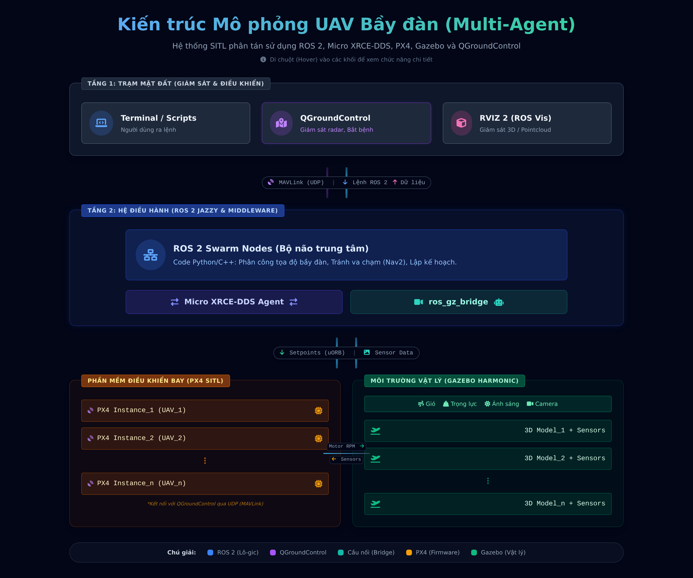

# 🛸 ROS 2 PX4 Swarm Simulation (Dockerized)

Nền tảng mô phỏng phân tán dành cho điều khiển bầy đàn UAV. Dự án được đóng gói 100% bằng Docker, sử dụng **ROS 2 Jazzy**, **PX4 SITL**, **Gazebo Harmonic** và giao thức **Micro XRCE-DDS**.

Kiến trúc Docker giúp loại bỏ hoàn toàn các lỗi xung đột môi trường, bảo vệ máy chủ (host) luôn sạch sẽ và hỗ trợ render đồ họa bằng CPU (Software Rendering) cho các máy không có card rời.

## 🏗 Kiến trúc Hệ thống

[](https://hcmut-lab.github.io/ros2-px4-swarm/docs/architecture.html)

*(Click vào sơ đồ hoặc [vào đây](https://hcmut-lab.github.io/ros2-px4-swarm/docs/architecture.html) để xem bản tương tác.)*

---

## ⚠️ Yêu cầu Hệ thống (Prerequisites)

- **Hệ điều hành:** Ubuntu 24.04 LTS
- **Môi trường hiển thị:** Bắt buộc dùng **X11** (không dùng Wayland)

> **Chuyển Wayland sang X11:**
> 1. `sudo nano /etc/gdm3/custom.conf`
> 2. Bỏ dấu `#` ở dòng `#WaylandEnable=false`
> 3. Lưu và `reboot`
> 4. Kiểm tra: `echo $XDG_SESSION_TYPE` → phải ra `x11`

---

## 🚀 Hướng dẫn Cài đặt (Lần đầu)

### Bước 1: Cài đặt QGroundControl (trên máy thật)

```bash
# Cài thư viện cần thiết
sudo usermod -a -G dialout $USER
sudo apt-get remove modemmanager -y
sudo apt install gstreamer1.0-plugins-bad gstreamer1.0-libav gstreamer1.0-gl -y
sudo apt install libfuse2 libxcb-xinerama0 libxkbcommon-x11-0 libxcb-cursor-dev -y
```

> ⚠️ **Đăng xuất và đăng nhập lại** để quyền `dialout` có hiệu lực.

```bash
# Tải QGC v5.0.8
mkdir -p ~/ENV && cd ~/ENV
wget -O QGroundControl.AppImage \
    https://github.com/mavlink/qgroundcontrol/releases/download/v5.0.8/QGroundControl-x86_64.AppImage
chmod +x ./QGroundControl.AppImage
```

---

### Bước 2: Cài đặt Docker Engine

```bash
sudo apt-get update
sudo apt-get install -y ca-certificates curl
sudo install -m 0755 -d /etc/apt/keyrings
sudo curl -fsSL https://download.docker.com/linux/ubuntu/gpg -o /etc/apt/keyrings/docker.asc
sudo chmod a+r /etc/apt/keyrings/docker.asc
echo \
  "deb [arch=$(dpkg --print-architecture) signed-by=/etc/apt/keyrings/docker.asc] https://download.docker.com/linux/ubuntu \
  $(. /etc/os-release && echo "$VERSION_CODENAME") stable" | \
  sudo tee /etc/apt/sources.list.d/docker.list > /dev/null
sudo apt-get update
sudo apt-get install -y docker-ce docker-ce-cli containerd.io docker-buildx-plugin docker-compose-plugin

# Cấp quyền user (không cần sudo khi dùng docker)
sudo usermod -aG docker $USER
newgrp docker
```

---

### Bước 3: Tạo Workspace và lấy code

```bash
mkdir -p ~/ros2_ws/src
cd ~/ros2_ws

# Clone repo vào thư mục src
git clone https://github.com/hcmut-lab/ros2-px4-swarm.git src/demo1
```

Tạo file `Dockerfile` tại `~/ros2_ws/Dockerfile`:

```dockerfile
FROM osrf/ros:jazzy-desktop-full

RUN apt-get update && apt-get install -y \
    git cmake build-essential wget curl nano python3-pip \
    && rm -rf /var/lib/apt/lists/*

WORKDIR /opt/env

# 1. Micro-XRCE-DDS-Agent
RUN git clone -b v2.4.3 https://github.com/eProsima/Micro-XRCE-DDS-Agent.git \
    && cd Micro-XRCE-DDS-Agent && mkdir build && cd build \
    && cmake .. && make -j$(nproc) && make install && ldconfig /usr/local/lib/

# 2. PX4-Autopilot + Gazebo Harmonic
# Bỏ --no-sim-tools để Gazebo được cài → gz_bridge được build
RUN git clone https://github.com/PX4/PX4-Autopilot.git --recursive
RUN bash PX4-Autopilot/Tools/setup/ubuntu.sh --no-nuttx
RUN cd PX4-Autopilot && make px4_sitl_default

WORKDIR /workspace/ros2_ws
RUN echo "source /opt/ros/jazzy/setup.bash" >> ~/.bashrc
```

Tạo file `docker-compose.yml` tại `~/ros2_ws/docker-compose.yml`:

```yaml
services:
  swarm_env:
    build: .
    container_name: px4_swarm_jazzy
    network_mode: "host"
    privileged: true
    ipc: host
    environment:
      - DISPLAY=${DISPLAY}
      - QT_X11_NO_MITSHM=1
    volumes:
      - /tmp/.X11-unix:/tmp/.X11-unix:rw
      - .:/workspace/ros2_ws
    devices:
      - /dev/dri:/dev/dri
    command: tail -f /dev/null
```

---

### Bước 4: Build Docker (lần đầu ~20-40 phút)

```bash
cd ~/ros2_ws
docker compose up -d --build
```

> ⚠️ Quá trình build lần đầu mất **20-40 phút** vì phải compile PX4 + Gazebo Harmonic. Các lần sau chỉ cần `docker compose up -d`.

---

## 🎮 Luồng Làm Việc Hàng Ngày

### 1. Khởi động container (trên máy thật)

```bash
cd ~/ros2_ws
docker compose up -d
```

### 2. Cấp quyền hiển thị đồ họa (bắt buộc trước khi dùng GUI)

```bash
xhost +local:root
```

### 3. Mở terminal trong container

```bash
docker exec -it px4_swarm_jazzy bash
```

---

## 🛸 Chạy Mô phỏng Bầy đàn 3 UAV (demo1)

Thực hiện **bên trong container**:

```bash
cd /workspace/ros2_ws/src/demo1
chmod +x run_swarm.sh   # Chỉ cần chạy 1 lần đầu

# Chạy headless (nhẹ hơn, theo dõi qua QGC):
./run_swarm.sh

# Hoặc mở kèm cửa sổ Gazebo 3D:
./run_swarm.sh --gui
```

> **Lưu ý khi dùng `--gui`:** Phải chạy `xhost +local:root` trên terminal máy thật **trước** khi chạy script.

Script tự động thực hiện theo thứ tự:
1. **Micro XRCE-DDS Agent** — cầu nối PX4 ↔ ROS 2 (port `8888`)
2. **Vá SDF** — xoá warnings không cần thiết trong model/world
3. **Gazebo server** — môi trường vật lý 3D, map Baylands
4. **3 UAV PX4** — spawn tuần tự tại `x = 0m, 2m, 4m`

Khi thấy `✅ Bầy đàn 3 UAV đã sẵn sàng!` là hệ thống hoạt động.

### Kết nối QGroundControl

Mở QGC trên máy thật — nhờ `network_mode: host`, QGC **tự động phát hiện cả 3 UAV** qua MAVLink broadcast, không cần cấu hình thêm.

> **EKF2 cần ~30-60 giây** để hội tụ sau khi khởi động. Cảnh báo `heading estimate invalid` sẽ tự hết.

### Dừng mô phỏng

Nhấn `Ctrl+C` trong terminal đang chạy script. Script tự dọn dẹp toàn bộ tiến trình PX4, Gazebo và Agent.

---

## 📂 Quản lý Nhiều Dự án (Modular Monorepo)

Kiến trúc **"1 Môi trường - N Dự án"**: tất cả kịch bản dùng chung 1 container.

```text
~/ros2_ws/
├── docker-compose.yml
├── Dockerfile
└── src/
    ├── demo1/                   # Bầy đàn 3 UAV cơ bản
    │   └── run_swarm.sh
    ├── project_1_circle_flight/ # Kịch bản bay vòng tròn
    │   ├── package.xml
    │   └── launch/circle.launch.py
    └── project_2_delivery/      # Kịch bản giao hàng
        ├── package.xml
        └── launch/delivery.launch.py
```

Luồng làm việc luân phiên (bên trong container):

```bash
# Dự án 1
colcon build --packages-select project_1_circle_flight
source install/setup.bash
ros2 launch project_1_circle_flight circle.launch.py

# Ctrl+C → chuyển sang Dự án 2
colcon build --packages-select project_2_delivery
source install/setup.bash
ros2 launch project_2_delivery delivery.launch.py
```

---

## 🛑 Tắt hệ thống

```bash
cd ~/ros2_ws
docker compose down
```

Mã nguồn tại `~/ros2_ws` vẫn được giữ nguyên.
